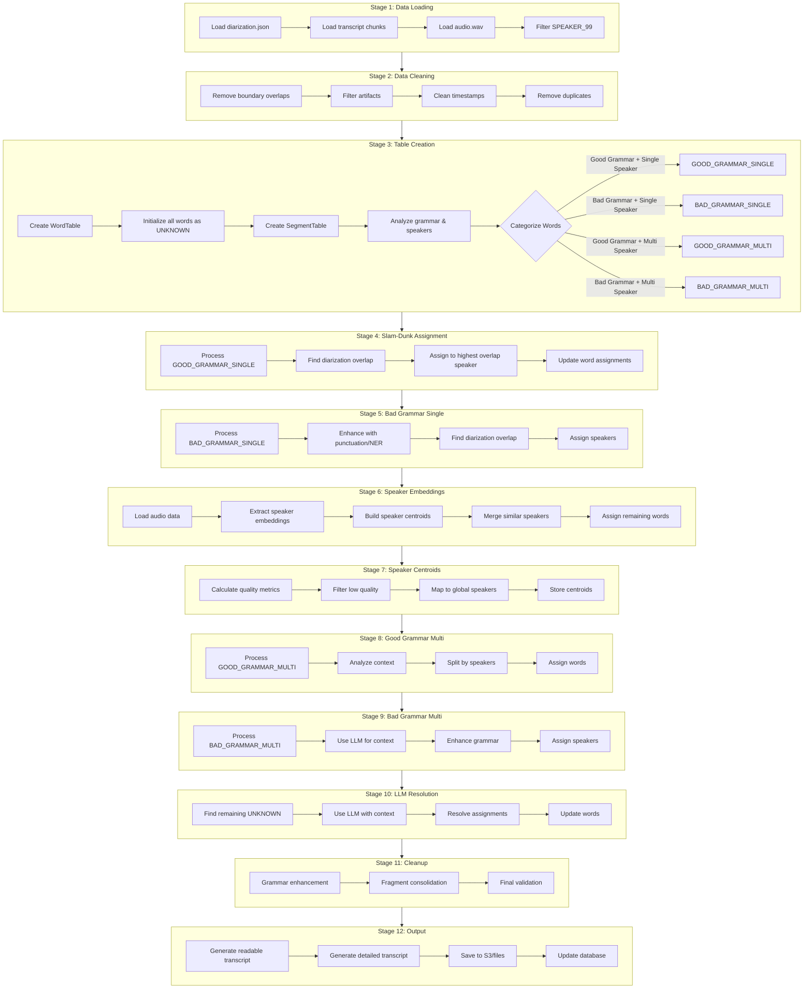

# Stitch Pipeline Logic Flow

## Overview
The stitch pipeline processes audio content through 12 stages to produce speaker-attributed transcripts. Each word flows through the pipeline with its state tracked in the WordTable.

## Data Flow Diagram



## Word State Transitions

### Initial State (Stage 3)
Every word starts as `UNKNOWN` with metadata tracking:
- `word_id`: Unique identifier
- `text`: The word text
- `start/end`: Timing information
- `confidence`: Whisper confidence
- `speaker_current`: Initially "UNKNOWN"
- `assignment_history`: Empty list

### Stage-by-Stage Word Processing

#### Stage 1-2: Data Preparation
- **Input**: Raw JSON files from S3/local
- **Processing**: Load, decompress, clean
- **Output**: Clean data ready for table creation
- **Word State**: N/A (words not yet created)

#### Stage 3: Table Creation & Categorization
- **Input**: Cleaned transcript and diarization data
- **Processing**: 
  - Create WordTable with all words
  - Analyze each segment for grammar quality
  - Check for single vs multi-speaker overlap
- **Output**: Words categorized into 8 categories
- **Word State Changes**:
  ```
  UNKNOWN → GOOD_GRAMMAR_SINGLE
  UNKNOWN → BAD_GRAMMAR_SINGLE  
  UNKNOWN → GOOD_GRAMMAR_MULTI
  UNKNOWN → BAD_GRAMMAR_MULTI
  ```

#### Stage 4: Slam-Dunk Assignment
- **Input**: Words marked as GOOD_GRAMMAR_SINGLE
- **Processing**: 
  - Find diarization segment with highest overlap
  - Trust categorization, assign regardless of overlap %
- **Output**: High-confidence speaker assignments
- **Word State Changes**:
  ```
  GOOD_GRAMMAR_SINGLE → SPEAKER_XX (e.g., SPEAKER_01)
  ```

#### Stage 5: Bad Grammar Single Speaker
- **Input**: Words marked as BAD_GRAMMAR_SINGLE
- **Processing**:
  - Enhance text with punctuation/NER
  - Find diarization overlap
  - Assign to best matching speaker
- **Output**: Speaker assignments for poorly punctuated text
- **Word State Changes**:
  ```
  BAD_GRAMMAR_SINGLE → SPEAKER_XX
  ```

#### Stage 6: Speaker Embeddings
- **Input**: All remaining unassigned words
- **Processing**:
  - Extract audio embeddings using pyannote
  - Build speaker centroids from assigned words
  - Merge similar speakers (>0.8 similarity)
  - Assign words based on embedding similarity
- **Output**: Acoustically-based speaker assignments
- **Word State Changes**:
  ```
  GOOD_GRAMMAR_MULTI → SPEAKER_XX
  BAD_GRAMMAR_MULTI → SPEAKER_XX
  UNKNOWN → SPEAKER_XX
  ```

#### Stage 7: Speaker Centroids
- **Input**: Word assignments from Stage 6
- **Processing**:
  - Calculate speaker quality metrics
  - Map to global speaker database
  - Store centroids for future use
- **Output**: Global speaker mappings
- **Word State Changes**: None (metadata updates only)

#### Stage 8-9: Multi-Speaker Resolution
- **Input**: Any remaining GOOD/BAD_GRAMMAR_MULTI words
- **Processing**:
  - Analyze conversation context
  - Use diarization and timing
  - Apply LLM for complex cases
- **Output**: Resolved multi-speaker segments
- **Word State Changes**:
  ```
  GOOD_GRAMMAR_MULTI → SPEAKER_XX
  BAD_GRAMMAR_MULTI → SPEAKER_XX
  ```

#### Stage 10: LLM Resolution
- **Input**: Any remaining UNKNOWN words
- **Processing**:
  - Use LLM with full context
  - Consider speaker centroids
  - Make final assignments
- **Output**: Final speaker assignments
- **Word State Changes**:
  ```
  UNKNOWN → SPEAKER_XX
  ```

#### Stage 11: Final Cleanup
- **Input**: All words with assignments
- **Processing**:
  - Enhance grammar and punctuation
  - Consolidate fragments
  - Validate assignments
- **Output**: Polished word table
- **Word State Changes**: Text updates only

#### Stage 12: Output Generation
- **Input**: Final word table
- **Processing**:
  - Group words by speaker
  - Generate readable transcript
  - Create detailed analysis
- **Output**: Final transcripts and metadata
- **Word State Changes**: None

## Assignment Tracking

Every speaker assignment is tracked with:
```python
{
    'stage': 'stage_name',
    'timestamp': unix_timestamp,
    'speaker': 'SPEAKER_XX',
    'method': 'assignment_method',
    'confidence': 0.0-1.0,
    'reason': 'Detailed explanation'
}
```

## Key Processing Patterns

### 1. Progressive Refinement
- Start with high-confidence assignments (good grammar + single speaker)
- Progressively handle more complex cases
- Use multiple signals (text, audio, context)

### 2. Multi-Modal Analysis
- **Text signals**: Grammar, capitalization, punctuation
- **Audio signals**: Speaker embeddings, diarization
- **Context signals**: Surrounding words, timing

### 3. Fallback Strategy
- Diarization → Embeddings → LLM
- Each stage handles failures from previous stages
- Final LLM stage ensures no words remain unassigned

### 4. Quality Tracking
- Every assignment includes confidence score
- Assignment history preserved for debugging
- Multiple validation passes ensure quality

## Performance Characteristics

### Bottlenecks
1. **Stage 6**: Speaker embedding extraction (GPU/MPS intensive)
2. **Stage 9-10**: LLM inference (compute intensive)
3. **Stage 1**: S3/file I/O (network dependent)

### Optimizations
1. **Shared Resources**: Audio and models loaded once
2. **Batch Processing**: Embeddings processed in batches
3. **Smart Categorization**: Process easy cases first
4. **Caching**: Stage results cached in test mode

## Output Format

Final transcript format:
```
[30s] [00:30] [Speaker 12345] [SPEAKER_a1b2c3d4] [SPEAKER_00]: Hello, this is the transcribed text.
```

Where:
- `[30s]`: Absolute seconds
- `[00:30]`: MM:SS format
- `[Speaker 12345]`: Universal speaker name
- `[SPEAKER_a1b2c3d4]`: Global speaker ID
- `[SPEAKER_00]`: Local diarization speaker